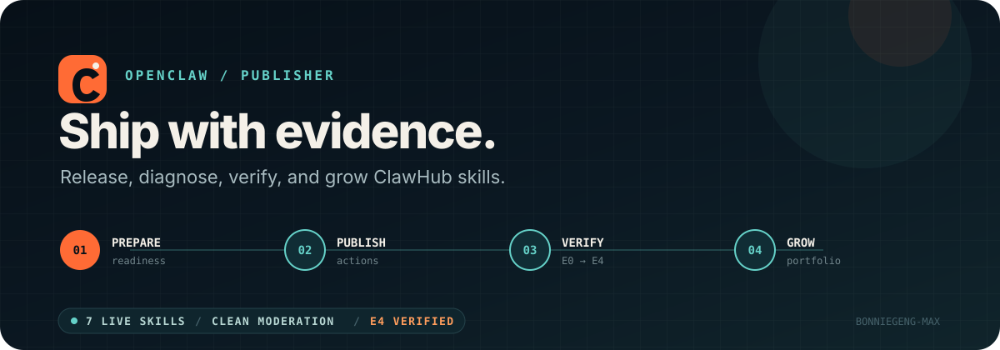

# OpenClaw Publisher



[](https://github.com/bonniegeng-max/openclaw-publisher/actions/workflows/metrics-tools-ci.yml)

Ship ClawHub skills with evidence, not guesswork.

这里是一组围绕 ClawHub 发布、排障、验证和增长的 Skill，也是一条可复用的 GitHub → ClawHub 自动发布链路。每个产品都来自真实发布问题，并经过公开 registry 检查与独立安装验证。

[ClawHub Publisher](https://clawhub.ai/user/bonniegeng-max) · [Growth Monitor](skill_growth_monitor.md) · [Automation Protocol](AGENTS.md) · [Idea Backlog](skill_idea_backlog.md) · [Contributing](CONTRIBUTING.md)

## 当前状态

最后验证：`2026-09-05`

| 信号 | 状态 |
|---|---|
| 已发布 Skill | 7 |
| ClawHub moderation | 全部 `clean` |
| 安装验证 | 7 个 current latest 均达到 `E4` |
| 自动发布 | GitHub `main` → ClawHub |
| 差分发布 | 只发布发生实质变化的 Skill |
| 主入口 | `Skill Publish Readiness 1.0.9` |

公开数据会变化，当前快照、口径限制和决策记录在 [`skill_growth_monitor.md`](skill_growth_monitor.md)。

## 从这里开始

如果只安装一个，先用主入口：

```bash
clawhub install skill-publish-readiness
```

它会审查文件、版本、slug、环境、安全风险和差异化，并给出阻塞项、证据矩阵与最小修复路径。

| 你正在面对的问题 | 推荐 Skill | 你会得到什么 |
|---|---|---|
| 第一次发布，不确定是否准备好 | [Skill Launch Checklist 1.0.3](https://clawhub.ai/bonniegeng-max/skills/skill-launch-checklist) | 一次轻量发布判断 |
| dry-run 能过，但担心发布质量 | [Skill Publish Readiness 1.0.9](https://clawhub.ai/bonniegeng-max/skills/skill-publish-readiness) | 完整发布前审查 |
| GitHub Actions 红了 | [GitHub Actions ClawHub Doctor](https://clawhub.ai/bonniegeng-max/skills/github-actions-clawhub-doctor) | 链路断点与最小修复 |
| 已经 push，不确定是否真能下载 | [Release Proof Builder 1.0.3](https://clawhub.ai/bonniegeng-max/skills/release-proof-builder) | `E0-E4` 发布证据 |
| 页面看起来像模板 | [Skill Positioning Audit](https://clawhub.ai/bonniegeng-max/skills/skill-positioning-audit) | 定位与商店页诊断 |
| 摘要太泛、太长 | [Skill Summary Rewriter](https://clawhub.ai/bonniegeng-max/skills/skill-summary-rewriter) | 可直接替换的摘要 |
| 已经发布多个 Skill，不知道该押注谁 | [Skill Portfolio Growth Audit 1.0.2](https://clawhub.ai/bonniegeng-max/skills/skill-portfolio-growth-audit) | 作品集决策与证据边界 |

## 产品路径

这 7 个 Skill 覆盖同一条发布旅程：

```text
Launch Checklist
      ↓
Publish Readiness
      ↓
GitHub Actions Doctor
      ↓
Release Proof Builder
      ↓
Positioning Audit / Summary Rewriter
      ↓
Portfolio Growth Audit
```

先判断是否值得发，再解决链路问题；发布完成后验证可安装性，最后才优化页面转化和作品集方向。

## 产品目录

| Skill | 角色 | 安装命令 | 验收前基线 |
|---|---|---|---|
| `skill-publish-readiness` | 主入口，完整发布审查 | `clawhub install skill-publish-readiness` | 43 downloads |
| `github-actions-clawhub-doctor` | CI/CD 发布排障 | `clawhub install github-actions-clawhub-doctor` | 11 downloads |
| `skill-launch-checklist` | 低门槛发布入口 | `clawhub install skill-launch-checklist` | 观察中 |
| `release-proof-builder` | 发布后证据核验 | `clawhub install release-proof-builder` | 观察中 |
| `skill-positioning-audit` | 商店页定位诊断 | `clawhub install skill-positioning-audit` | 观察中 |
| `skill-summary-rewriter` | 摘要改写 | `clawhub install skill-summary-rewriter` | 观察中 |
| `skill-portfolio-growth-audit` | 作品集增长决策 | `clawhub install skill-portfolio-growth-audit` | 观察中 |

下载数字是 `2026-09-05` 全量 E4 验收前的 ClawHub 基线，不等同于安装用户数。后续主动安装污染了平台计数，当前原始值和口径说明见增长报告。

## 真实失败来源

这套产品线源于实际发生过的发布事故：

- reusable workflow 引用不存在，Actions 无法启动真实发布
- slug 使用 ClawHub 受保护命名空间，首次上架失败
- `pending-publication` 被错误映射为失败
- 上传票据瞬时过期，需要有限退避重试
- 每次发布全部 Skill，制造无意义版本
- 展示名回退成 slug，降低搜索结果可读性
- GitHub 已推送，但 registry 或独立安装仍未证明成功

主入口中的 [`real_publish_failure_review.md`](skills/skill-publish-readiness/examples/real_publish_failure_review.md) 展示了证据、根因、修复和最终 E4 验收。

## 发布证据

仓库用 `E0-E4` 区分“做过动作”和“结果已成立”：

| 等级 | 含义 |
|---|---|
| `E0` | 只有本地文件 |
| `E1` | GitHub 远端包含目标提交 |
| `E2` | 目标发布 workflow 已完成且成功 |
| `E3` | ClawHub registry 可读取正确版本与元数据，且 moderation 为 `clean` |
| `E4` | 指定版本可独立安装、核心文件与源码一致，并记录主动安装造成的指标污染 |

只有达到 `E4`，才在这里标记为“已上线、可下载使用”。

## 自动发布

### Skill

- pull request：对改动过的 `skills/**` 执行 dry-run
- push 到 `main`：只发布改动过的 Skill
- workflow dispatch：支持手动重跑
- `.clawhub/skill-catalog.json`：统一管理展示名、categories 和 topics
- 发布命令显式传递稳定 slug 和人类可读 name，避免展示名变化创建错误 ID
- 瞬时上传错误最多退避重试 3 次，确定性错误直接失败

### Plugin

- pull request：只验证改动过的 plugin
- push 到 `main`：只发布改动过的 plugin
- workflow dispatch：可指定单个 plugin，也可扫描全部 plugin

## 复用这套仓库

先准备 ClawHub CLI：

```bash
npm i -g clawhub
clawhub login
clawhub whoami
```

在 GitHub 仓库的 `Settings → Secrets and variables → Actions` 中配置：

- `CLAWHUB_OWNER`
- `CLAWHUB_TOKEN`

新增 Skill 时至少包含：

```text
skills/<stable-slug>/
├── SKILL.md
├── CHANGELOG.md
├── .clawhubignore
├── examples/
├── references/
└── templates/
```

在 `.clawhub/skill-catalog.json` 中补充展示名、categories 和 topics，然后先执行离线 catalog 预检：

```bash
python3 scripts/validate_skill_catalog.py
```

预检会核对 metadata 类型、目录覆盖、必需文件、stable slug 规则、
展示名唯一性，以及 `SKILL.md` 的 name/slug/description/semver 与
CHANGELOG 当前版本；同时拒绝敏感文件名、私钥扩展名、依赖/缓存目录和
symlink。安全检查只报告相对路径，不读取或回显秘密内容。失败时输出结构化
JSON 并以退出码 `2` 结束，不访问 ClawHub。通过后再执行：

```bash
clawhub skill publish ./skills/<stable-slug> \
  --slug <stable-slug> \
  --name "<Human Readable Name>" \
  --dry-run \
  --owner <owner>
```

push 到 `main` 后，自动发布只处理发生变化的目录。

## 仓库结构

```text
.
├── .clawhub/
│   └── skill-catalog.json
├── .github/workflows/
│   ├── clawhub-skill-publish.yml
│   ├── clawhub-skill-publish-local.yml
│   ├── clawhub-plugin-publish.yml
│   └── metrics-tools-ci.yml
├── skills/
│   └── 7 个已发布 Skill
├── plugins/
├── scripts/
│   ├── collect_clawhub_metrics.py
│   ├── collect_clawhub_search_visibility.py
│   ├── compare_clawhub_metrics.py
│   ├── run_clawhub_growth_monitor.py
│   └── validate_skill_catalog.py
├── metrics/
│   └── README.md
├── skill_growth_monitor.md
├── skill_growth_roadmap.md
└── skill_idea_backlog.md
```

## 被动指标采集

常规观察不再安装未变化版本。使用只读采集器从 catalog 自动发现所有 Skill，并通过 `clawhub inspect --json` 生成统一快照：

```bash
python3 scripts/collect_clawhub_metrics.py
```

默认输出到 `metrics/clawhub-latest.json`，并在下一次成功采集时将旧快照保留为 `metrics/clawhub-previous.json`。脚本会记录采集方法、`activeInstall: false` 和数据边界，任何一个 Skill 查询失败时都不会轮换或写入不完整快照。

保留两个不同时间的快照后，可在本地生成差异报告，不再访问 ClawHub：

```bash
python3 scripts/compare_clawhub_metrics.py \
  metrics/clawhub-previous.json \
  metrics/clawhub-latest.json \
  --output metrics/clawhub-change-report.md
```

对比器把版本变化、非 `clean` moderation、Skill 消失和计数回退标为验证事项。downloads、installs 与 stars 的正向变化只记录为观察信号，不自动解释为自然增长；只有同口径、无主动安装且间隔至少 7 天的快照才标记为可进入增长决策。

搜索可见性使用独立的只读采集器，并由受版本控制的真实任务查询清单驱动：

```bash
python3 scripts/collect_clawhub_search_visibility.py
```

脚本会确认查询配置完整覆盖 catalog 中的全部 Skill，再记录目标 Skill 的当前排名和同页结果。任何查询或输出解析失败时都不会写入部分快照。

同一个离线对比器会自动识别搜索快照，输出 `up`、`down`、`gained`、`lost` 或 `unchanged`；查询配置发生变化时拒绝把两轮排名当作可比证据。

完整周检使用统一入口：

```bash
python3 scripts/run_clawhub_growth_monitor.py
```

它会先在临时目录完成两类采集、Markdown 差异报告和机器可读 JSON 对比结果，全部成功后再将 latest、previous、差异报告和组合闸门作为一个可回滚输出集合提交。任一采集、对比或正式文件替换失败时，现有完整基线都会恢复。

统一入口还会生成 `metrics/clawhub-growth-decision.json` 和 `metrics/clawhub-growth-decision.md`。只有指标与搜索两侧的 `evidenceQuality.decisionReady` 同时为 `true`，且前后两组指标/搜索快照的采集时间分别相差不超过 15 分钟，组合闸门才会返回 `decisionReady: true`；单侧合格只能继续观察，跨轮次误拼、污染、口径不一致或证据格式错误会优先要求修复数据质量。

`metrics/observation-policy.json` 记录维护后首次允许采样的 `notBefore`。常规运行在该时间前会零请求退出，即使还没有 latest 快照；到期后自动放行。已有完整采集时，距离两类 latest 中较新的采集时间不足 144 小时也会直接跳过。只有版本、moderation 或公开文件异常需要提前复核时才使用 `--force`；它会绕过观察窗口与采样间隔，但不会绕过已有快照的时间完整性校验或离线对比器的 7 天决策门槛。

运行离线测试：

```bash
python3 -m unittest discover -s tests
```

## 增长原则

- 优先优化已有采用信号的产品
- 新版本必须包含可解释的实质变化
- downloads、installs、stars 和搜索结果分别记录
- 新 Skill 至少观察 7 天，不用短期零数据判定失败
- 竞品成熟且差异不足时，不复制同类产品
- 新方向必须强化“ClawHub 发布与增长工具作者”这条主线

`Skill Publish Readiness 1.0.9`、`Skill Launch Checklist 1.0.3`、`Release Proof Builder 1.0.3` 和 `Skill Portfolio Growth Audit 1.0.2` 已完成 E4 验收。最新自然观察起点为 `2026-09-05 18:45:38`（北京时间）；验收流量不计入自然增长，下一个产品或插件仍由完整观察窗口后的真实采用数据和竞争缺口决定。
